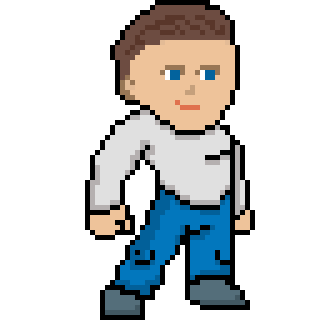
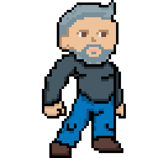
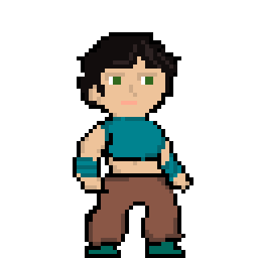
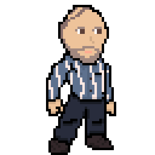
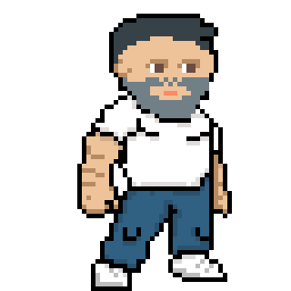
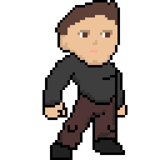
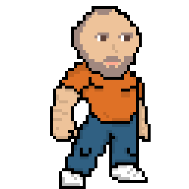

# 🎮 **Smash Ginebró - Game Design Document** 🎮

## **Introducció**
¡Benvinguts al món èpic de **Smash Ginebró**! 🌟 Un joc de lluita en 2D on els professors es converteixen en guerrers i es llancen a una batalla frenètica al cor de l'institut. Agafa el teu teclat i prepàrate per una experiència única de combat inspirada en Super Smash Bros, però amb un gir molt especial. 💥

## **Història 📜**
En un institut dedicat als cicles superiors d'informàtica, la monotonia dels professors es veu interrompuda per un misteriós anunci. Desafia'ls a una competició fora del comú i arrossega'ls a una lluita èpica per demostrar qui és el mestre indiscutible. Amb l'ajuda de personatges carismàtics i misteris ocults, el destí de Smash Ginebró es desplegarà a mesura que et submergeixis en aquesta narrativa emocionant.

## **Punts Clau del Joc 🎯**

### **Personatges**
Converteix-te en professors transformats en guerrers:

1. **Imanol Valle**
  
   - **Habilitats:** Correcamins, Elegància, Level Design (Ultimate)
   - **Armes:** Diploma

2. **Vladímir Bellavista**
  
   - **Habilitats:** Colleja, Menysprear (àrea), Cafè (Ultimate)
   - **Armes:** Punys

3. **Sofia Torrado**
  
   - **Habilitats:** Macbook, Puas, Pinzellada (Ultimate)
   - **Armes:** Pinzell gegant

4. **Ivan Nieto**

   - **Habilitats:** Abraçada, Cabreig, Base de Dades (Ultimate)
   - **Armes:** ThinkPad

5. **Joan Pardo**

   - **Habilitats:** Pull, Pizarrazo, Transformació (Ultimate)
   - **Armes:** A mà oberta

6. **Rubèn Martínez**

   - **Habilitats:** Donete, Donete Caducat, Pluja de Donetes (Ultimate)
   - **Armes:** Donetes (a distància)

7. **Salvador Quadrades**
  
   - **Habilitats:** Anchored, Begudes cod zombis, Multiply (Ultimate)
   - **Armes:** Raygun

8. **???**
<!---->
   - **Habilitats:** Change, Buff, Configurar impressora (Ultimate)
   - **Armes:** Totes

...

### **Mecàniques de Joc**
- **Càmera 2D 🎥:** Vista lateral per veure tot el camp de batalla.
- **Controls Simples 🕹️:** Moviments, atacs, bloquejos i habilitats amb facilitat.
- **Puntuació 📊:** Guanya punts amb victòries i compleix objectius específics.
- **Desenvolupament Història 📖:** Batalles en diferents zones de l'institut amb enemics més forts.

### **Interfície Visual 🖼️**
-  **Inici:** Pantalla inicial amb l'ambient del joc.
-  **Configuració:** Personalitza la teva experiència de joc.
-  **Selector Personatge:** Escull el professor que et representarà a la batalla.
-  **Selector Mapa:** Triomfa en diferents zones de l'institut.
-  **Configuració Torneig:** Prepara les regles del torneig a la teva manera.
-  **Joc:** Llança't a la batalla i domina el camp de batalla.

### **Emoticones d'Acció 💥**
- ¡Preparat per la batalla!
- ¡Derrota èpica!
- ¡Desbloqueja nous personatges!

## **Contacte i Diversió 🚀**
Per a més informació, contacta'ns a [Duck4hats@gmail.com](mailto:duck4hats@gmail.com). ¡Que comenci la diversió a Smash Ginebró! 🌟

